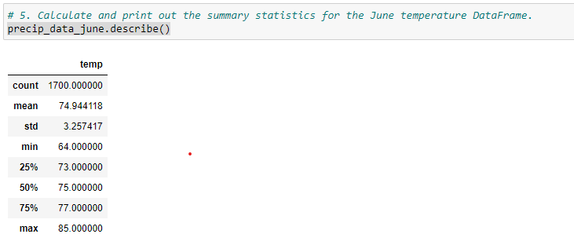
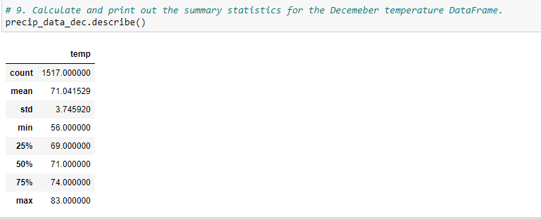

# surfs_up_UT_DATA

## Resources

- Data Source:
  - [Hawaii (sql)](./hawaii.sqlite)

- Software:
  - SQLite
  - Python 3.7
  - Jupyter Notebook
  
## Purpose Overview

The client wants more information about temperature trends before opening the surf shop. Specifically, they want temperature data for the months of June and December in Oahu, in order to determine if the surf and ice cream shop business is sustainable year-round.

### Deliverable 1

Using Python, Pandas functions and methods, and SQLAlchemy, you’ll filter the date column of the Measurements table in the hawaii.sqlite database to retrieve all the temperatures for the month of June. You’ll then convert those temperatures to a list, create a DataFrame from the list, and generate the summary statistics.

### Deliverable 2

Using Python, Pandas functions and methods, and SQLAlchemy, you’ll filter the date column of the Measurements table in the hawaii.sqlite database to retrieve all the temperatures for the month of December. You’ll then convert those temperatures to a list, create a DataFrame from the list, and generate the summary statistics.

## Results

####  Three key differences in weather between June and December in Ohahu
    - The mean temperature in June is roughly three degrees warmer compared to December
    - The minimum recorded temperature is eight degrees cooler in December compared to June
    - Using the median temps and 1.5IQR rule we can see that most likely temperatures for each month will fall between the following ranges:
       - June (69 - 81) F
       - December (63.5 - 78.5) F

## Summary

Based on the previously recorded temperatures for Ohahu, the client should expect to see appropriate weather in both June and December.

##### Additional Queries
```sql
results_dec = session.query(Measurement.date, Measurement.prcp).\
    filter(extract('month', Measurement.date)==12).\
    all()

results_june = session.query(Measurement.date, Measurement.prcp).\
    filter(extract('month', Measurement.date)==6).\
    all()
```

## Analysis



- [June Temps (png)](./analysis/june_temps.png)



- [December Temps (png)](./analysis/dec_temps.png)